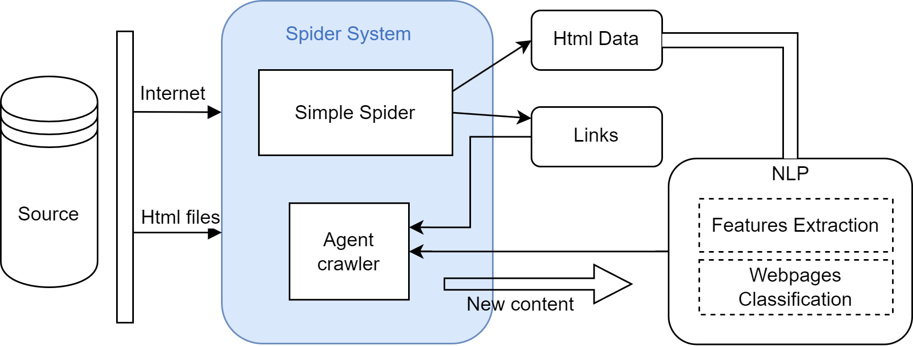
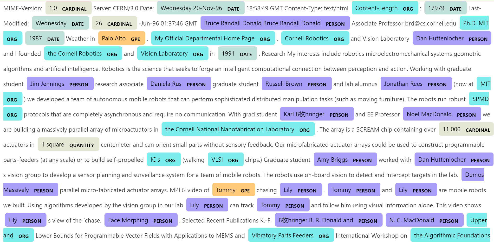
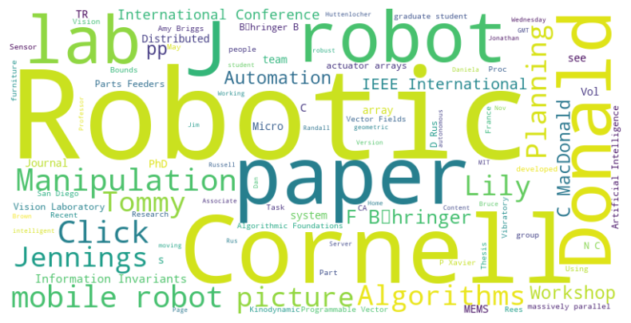
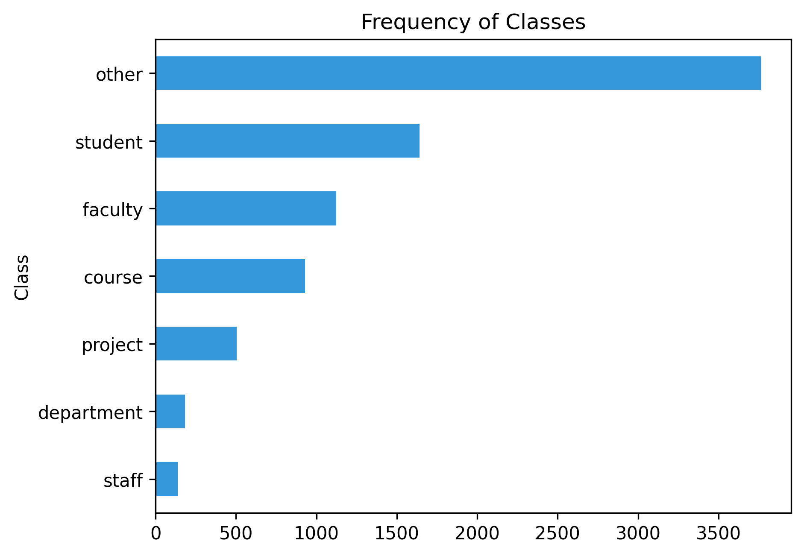
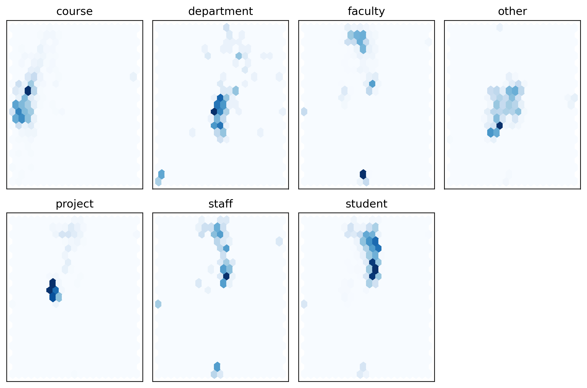
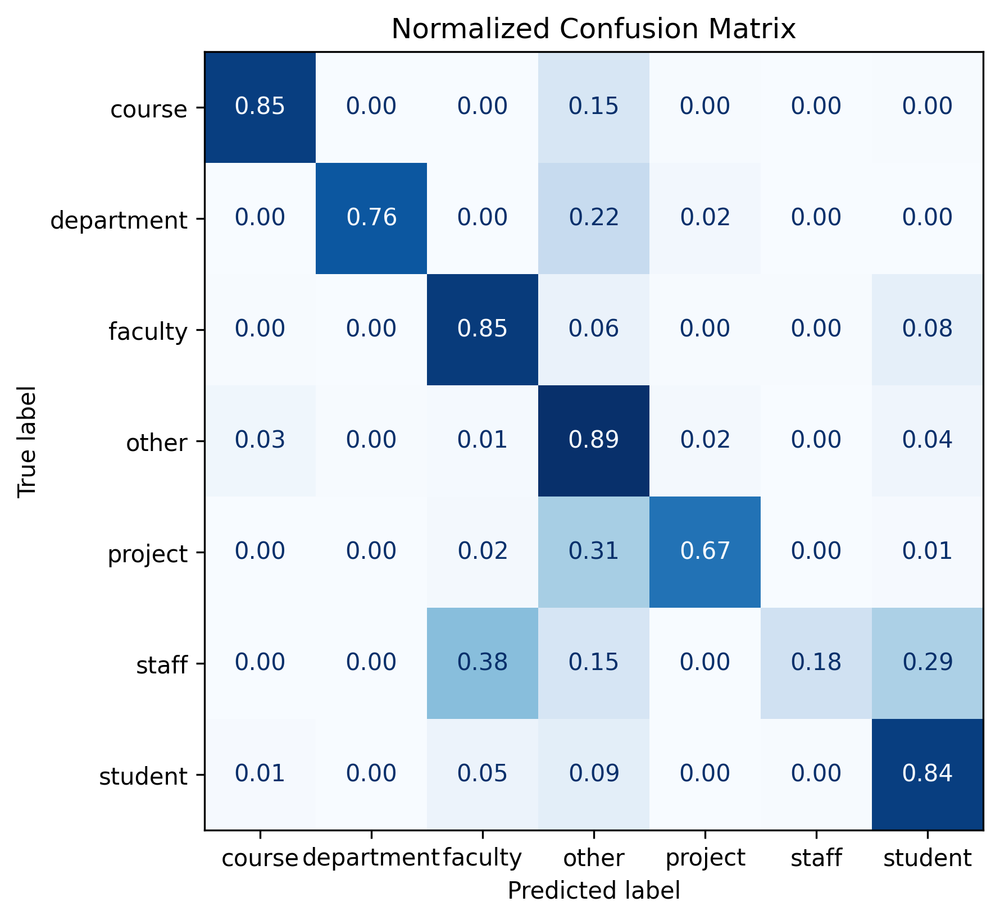
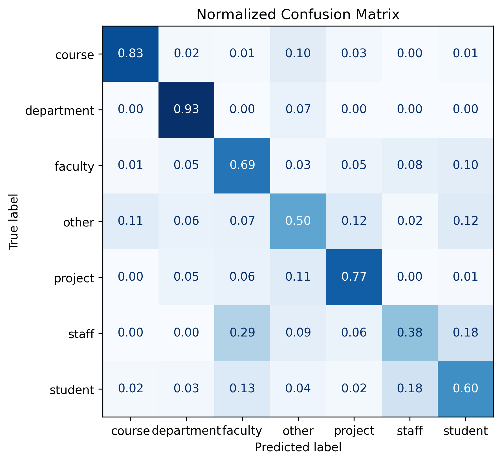

# Smart Knowledge Engine based on WebKB

Virtual Env: anaconda python3.10.9

The Smart Knowledge Engine leverages the WebKB dataset to enable advanced text mining, entity recognition, and visualization. This system is designed to integrate traditional machine learning methods and modern natural language processing techniques to provide actionable insights. The following sections outline its conceptual framework, example applications, feature visualization, and evaluation results.
## Concept frame:

The conceptual framework outlines the key components and interactions of the knowledge engine, including data preprocessing, feature extraction, model training, and evaluation. It serves as the foundation for building intelligent and interpretable models.

## An example for Entity Recognition:
This example demonstrates the entity recognition capability of the system. Named entities such as locations, organizations, and people are highlighted, showcasing the accuracy and relevance of the entity recognition pipeline. It uses pre-trained models fine-tuned on WebKB data to identify domain-specific entities.

## Word Cloud
The word cloud provides a high-level visualization of the most frequently occurring terms in the dataset. Larger words indicate higher frequency, allowing users to quickly identify key topics and trends within the dataset.

## Local Dataset Overview 
This overview highlights the structure of the dataset, enabling a better understanding of its composition and complexity.

## 2 dimensional features
Using dimensionality reduction techniques like PCA (Principal Component Analysis) or t-SNE (t-Distributed Stochastic Neighbor Embedding), the dataset is visualized in two dimensions. This visualization helps identify clusters and outliers, offering insights into the separability of different classes.

## Traditional Method

### SVM
SVM is effective for this dataset due to its ability to handle high-dimensional feature spaces. The confusion matrix highlights the areas where the model excels and where it could be improved.

#### Multi-Class SVM Mathematical Formulations

1. **One-vs-Rest (OvR):**  
   In the One-vs-Rest method, each class is treated as a binary classification problem. The class with the highest score is selected as the final prediction:
   
   $f(x) = \text{argmax}_{i} \ (w_i \cdot x + b_i)$
   
   Where:
   - $\( w_i \)$: The weight vector for class $\( i \)$.
   - $\( b_i \)$: The bias term for class $\( i \)$.
   - $\( x \)$: The input sample.

3. **One-vs-One (OvO):**  
   In the One-vs-One approach, a binary classifier is trained for each pair of classes. The final prediction is determined by majority voting:  
   $$
   C(x) = \text{argmax}_{i} \ \sum_{j \neq i} h_{ij}(x)
   $$  
   Where:
   - \( h_{ij}(x) \): The decision function for the classifier between classes \( i \) and \( j \).

4. **Crammer and Singer's Method:**  
   This method directly optimizes a multi-class objective by maximizing the margin between all classes:  
   $$
   \text{minimize} \ \frac{1}{2} \sum_{i=1}^{k} \|w_i\|^2 + C \sum_{i=1}^{n} \sum_{j \neq y_i} \text{max}(0, 1 - (w_{y_i} \cdot x_i - w_j \cdot x_i))
   $$  
   Where:
   - \( y_i \): The true class label of sample \( x_i \).
   - \( k \): The number of classes.
   - \( n \): The number of samples.
   - \( C \): Regularization parameter to balance margin maximization and error minimization.

5. **Hinge Loss for Multi-Class SVM:**  
   The hinge loss for a multi-class SVM can be expressed as:  
   $$
   L = \sum_{i=1}^{n} \sum_{j \neq y_i} \text{max}(0, 1 - (w_{y_i} \cdot x_i - w_j \cdot x_i))
   $$  
   This loss function penalizes the model when the margin between the correct class and other classes is less than 1.

---

These mathematical formulations explain the core principles behind multi-class SVM approaches. 

### Gaussian Naive Bayes
Gaussian Naive Bayes is a fast and interpretable method that works well for datasets with normally distributed features. Despite being slightly less accurate than SVM, it provides valuable probabilistic insights.

